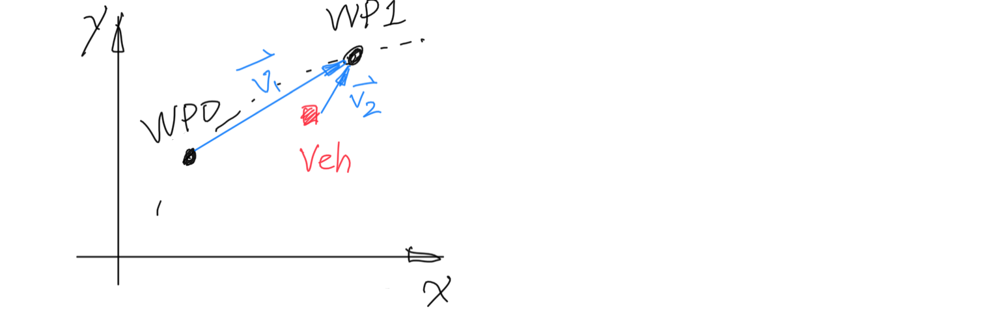

This is the project repo for the final project of the Udacity Self-Driving Car Nanodegree: Programming a Real Self-Driving Car. For more information about the project, see the project introduction [here](https://classroom.udacity.com/nanodegrees/nd013/parts/6047fe34-d93c-4f50-8336-b70ef10cb4b2/modules/e1a23b06-329a-4684-a717-ad476f0d8dff/lessons/462c933d-9f24-42d3-8bdc-a08a5fc866e4/concepts/5ab4b122-83e6-436d-850f-9f4d26627fd9).


### System Architecture

The following is a system architecture diagram showing the ROS nodes and topics used in the project.


The code for this project is mainly contained in the `./ros/src/` directory. Below are the high level description for the ROS packages to be modified:

- **Traffic Light Detection Node:** this package is located at `./ros/src/tl_detector/`. This nodes publishes the locations to stop for red traffic lights to the `/traffic_waypoint` topic.
- **Waypoint Updater Node:** this package is located at `./ros/src/waypoint_updater`. The purpose of this node is to update the target velocity property of each waypoint based on traffic light and obstacle detection data. 
- **Twist Controller:** this package is located at `./ros/src/twist_controller`. This package contains the files that are responsible for control of the vehicle: the node `dbw_node.py` and the file `twist_controller.py`, along with a pid and lowpass filter that you can use in your implementation. 


### Implementation Details

#### 1. Waypoint Updater Node - Base

As the very first step, it will be necessary to implement a basic part of the `waypoint_updater` node, which is to publish a given number of waypoints ahead of vehicle, regardless of traffic lights and obstacles. The waypoints to publish are a subset of `base_waypoints` with the first point being closest and ahead of the car.

- **Determining the closest waypoint:** 

  The easiest and most obvious way to implement this is to loop through the whole list of `waypoints` in `base_waypoints`,  calculate the distance between each waypoint and the vehicle's current position. However, this would be running at a time complexity of `O(N)`. In the project walk through, a faster way is provided by using ["K-d Tree"](https://en.wikipedia.org/wiki/K-d_tree), which has a time complexity of `O(logN)`. We imported the `scipy.spatial.KDTree` library to implement this.

  The `waypoint_tree` class is constructed by: 

  ```python
  self.waypoint_tree = KDTree(self.waypoints_xy_coords)
  ```

  where, `waypoints_xy_coords` are the list of [x, y] coordinates of all waypoints.

  Then, at each timestep, the closest neighbor can be queried by the `KDTree.query` method:

  ```python
  closest_idx = self.waypoint_tree.query([ego_x, ego_y], 1)[1]
  ```

  

- **Ensure the selected waypoint is ahead of vehicle:** 

  It is desired to have the first waypoint being right ahead of the vehicle's current position, with the previous method, this is not guaranteed, so we need to implement a feature to check if the closest waypoint from previous step is ahead or behind the vehicle.

  The math used here is: if two vectors are pointing toward the same direction, the dot product should be positive. (*Note: due to the vector notation I am using here, the positive/negative of dot product is a bit different from project walkthrough*)

  

  

  As illustrated in above figure, we can construct two vectors, both ends at the "closest waypoint" from the KDtree query, with `v1` starting from the one previous entry in the waypoint list, and `v2` starting from the vehicle position. 

  The dot product can be calculated by using the `numpy.dot` function.

  

- **Publishing the required number of waypoints:**

  Once we have the index of waypoint that is closest and is ahead of vehicle, we can simply publish the desired number of waypoints by outputing a sliced list of `base_waypoints`.  

  

#### 2. DBW Node

Once the basic waypoints updater is implemented, from the simulator, the waypoints are now visible ahead of the vehicle, however the car is not following them. The goal for this part of the project is to implement the drive-by-wire node (`dbw_node.py`) which will use various controllers to provide appropriate throttle, brake, and steering commands, so the car will be able to follow the waypoints published.

- **Throttle:** a PID controller is used to control the vehicle to follow linear vehicle speed target (`linear_vel`) sent from the `/twist_cmd` message from the Waypoint Follower node. The velocity error term is the difference between speed target and the current vehicle speed, by subscribing to `/current_velocity` message from the Car/Simulator.
- **Brake:** If vehicle is stationery: a constant, hardcoded brake torque is published; if deceleration is needed and the throttle is already zero: the brake torque is calculated by multiplying deceleration (m/s^2), vehicle mass, and the wheel diameter.
- **Steering:** the `yaw_controller` provided in the starter code is used, it calculates the steering angle needed to achieve the angular speed target (`angular_vel`) sent by the  `/twist_cmd` message from the Waypoint Follower node.

It is important to only publish those commands when driver-by-wire is enabled.


#### 3. Traffic Light Detection

In the traffic light detection module, we need to find the closest traffice light, determine its color, determine the stop line if it's red, and publish  `/traffic_waypoint` information. In this attempt, I didn't implement using camera image to detect traffic light state using a classifier, the traffic light state comes from the simulator.


#### 4. Waypoint Updater Node - with Traffic Light Info

To finalize the project and let the car stop at traffic light when it's red. We need to add a few lines of code to utilize the `/traffic_waypoint` information from the previous step.

When a red light is detected, we will need to publish a new set of waypoint to allow the vehicle to decelerate smoothly and stop at the stop line. The velocity of a constant deceleration rate can be described as: `vel = sqrt(2 * a_DECEL * dist)`

where, `a_DECEL` is the deceleration in m/s2, and `dist` is the distance from current position to the stop position. As the equation suggests, the velocity will decay and approach zero when getting closer to the red light stop line. We will also keep a zero velocity for all waypoints that are beyond the stop line, and keep the speed limit as the ceiling. The overall expression of velocity vs distance would be:

```pseudocode
if dist < 0:
	vel = 0
else:
	vel = sqrt(2 * a_DECEL * dist)
	
return min(vel, max_sp_lim)
```

With the velocity value for each waypoint updated, the car would then stop at the red light and resume driving once the light turns green, a snippet of the simulator result is shown below.


### Future Improvements

#### 1. Implement Traffic Light Classifier

Use the camera image from the car to know if the vehicle is approaching a red light, instead of relying on broadcasted ground truth, would make this project much more complete. The TL detection and classification module would need to first segment camera image and find the traffic light (object detection), then run the "sliced" traffic light image through a classifier to get the traffic light state.

#### 2. Fine Tune Vehicle Behavior at Traffic Light

More similar to a human driver, it would be better if the vehicle can accelerate more aggresively when traffic light turns green, however we need to still keep in mind the acceleration, jerk, and make sure the vehicle travels below the speed limit.

